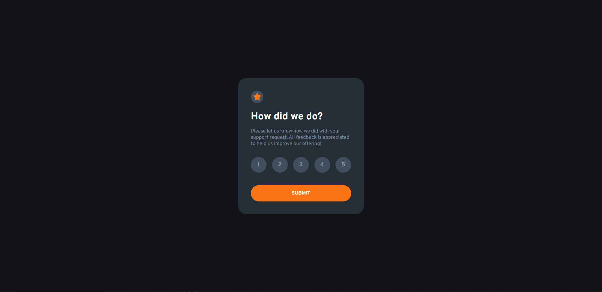

# Frontend Mentor - Interactive rating component solution

This is a solution to the [Interactive rating component challenge on Frontend Mentor](https://www.frontendmentor.io/challenges/interactive-rating-component-koxpeBUmI). Frontend Mentor challenges help you improve your coding skills by building realistic projects. 

## Table of contents

- [Frontend Mentor - Interactive rating component solution](#frontend-mentor---interactive-rating-component-solution)
  - [Table of contents](#table-of-contents)
  - [Overview](#overview)
    - [The challenge](#the-challenge)
    - [Screenshot](#screenshot)
    - [Links](#links)
  - [My process](#my-process)
    - [Built with](#built-with)
    - [What I learned](#what-i-learned)
  - [Author](#author)

## Overview

### The challenge

Users should be able to:

- View the optimal layout for the app depending on their device's screen size
- See hover states for all interactive elements on the page
- Select and submit a number rating
- See the "Thank you" card state after submitting a rating

### Screenshot



### Links

- Solution URL: [https://github.com/rovicbalingbing/interactive-rating-component-frontendMentor.git](https://github.com/rovicbalingbing/interactive-rating-component-frontendMentor.git)
- Live Site URL: [https://rovicbalingbing.github.io/interactive-rating-component-frontendMentor/](https://rovicbalingbing.github.io/interactive-rating-component-frontendMentor/)

## My process

### Built with

- Semantic HTML5 markup
- CSS custom properties
- Flexbox
- Media queries
- Local Storage

### What I learned

```html
<div class="ratings">
  <h3 class="numberOne numbers" onclick="selectRating(1)">1</h3>
  <h3 class="numberTwo numbers" onclick="selectRating(2)">2</h3>
  <h3 class="numberThree numbers" onclick="selectRating(3)">3</h3>
  <h3 class="numberFour numbers" onclick="selectRating(4)">4</h3>
  <h3 class="numberFive numbers" onclick="selectRating(5)">5</h3>
</div>
```
```css
:root {
  /* PRIMARY COLOR */
  --orange: hsl(25, 97%, 53%);

  /* NEUTRAL COLORS */
  --white:  hsl(0, 0%, 100%);
  --light-grey: hsl(217, 12%, 63%);
  --medium-grey: hsl(216, 12%, 54%);
  --light-dark-blue: hsl(212, 19%, 31%);
  --dark-blue: hsl(213, 19%, 18%);
  --very-dark-blue: hsl(216, 12%, 8%);

  /* FONTS */
  --font-main: 'Overpass', sans-serif;

  /* TYPOGRAPHY */
  --font-size: 15px;
}
```
```js
function submitRating() {
  const selectedRating = localStorage.getItem('selectedRating');
  const successLink = document.querySelector('.submit-btn');
  successLink.href = 'success.html';
  successLink.search = '?rating=' + selectedRating;
}
```

## Author

- Website - [John Rovie R. Balingbing](https://github.com/rovicbalingbing)
- Frontend Mentor - [@rovicbalingbing](https://www.frontendmentor.io/profile/rovicbalingbing)
- Twitter - [@roscidDreaming](https://www.twitter.com/roscidDreaming)
